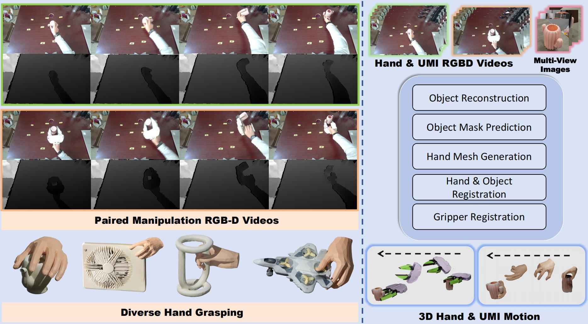
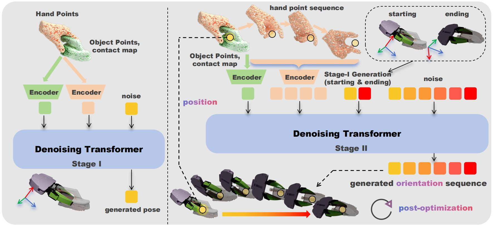

# CosmoH2G: Hand-to-Gripper Transfer for Complex Spatial Manipulation

<p align="center">
  <a href="https://cosmoh2g.github.io/"></a>
  <a href="https://arxiv.org/abs/2609.07498"></a>
</p>

<p align="center">
  <b>CosmoH2G</b> transfers complex spatial hand demonstrations to robotic grippers<br>
  through a two-stage, data-driven framework.
</p>

---

<p align="center">
  
  
</p>

<p align="center">
  <b>Left:</b> Dataset — 6,189 episodes · 1,254 objects &nbsp;|&nbsp;
  <b>Right:</b> Method — Stage-I keyframes → Stage-II full sequence
</p>

## Citation

```bibtex
@misc{zhao2026cosmoh2ghandtogrippertransferdataset,
      title={CosmoH2G: A Hand-to-Gripper Transfer Dataset and Baseline Method for Object Manipulation with Complex Spatial Movements}, 
      author={Hongxiang Zhao and Mutian Xu and Zeyu Jin and Yiming Hao and Shuguang Cui and Xiaoguang Han},
      year={2026},
      eprint={2609.07498},
      archivePrefix={arXiv},
      primaryClass={cs.RO},
      url={https://arxiv.org/abs/2609.07498}, 
}
